## Directory
[Home](index.md) 
[Milestone 1](milestone1.md) 
[Milestone 2](ms2.md) 
[Milestone 3](3-mile.md) 

## Milestone 3: Design Alternatives         

### __1. User Experience Requirements__

> *User Stories*

**1. Group Work**

User Type: Student

As a student, I would like to collaborate with my classmates in real time using rich markup tools so that I can effectively complete due assignments in a collaborative environment.

**2. Class Discussion**

User Type: Student

As a student, I would like to contribute to the class discussion to participate, add to the discussion, and / or voice my stance on a subject matter.

**3. Ask Questions**

User Type: Student

As a student, I would like to ask questions to the entire class for anyone to respond so I can receive a wide variety of responses.

**4. View Previous Discussions**

User Type: Student or Instructor

As a user of the system, I would like to be able to view and search previous discussion topics easily, in retrospect to view previous posts. 

**5. Pin Key Threads**

User Type: Instructor

As an instructor, I would like to pin important threads to the top for key notes for students to inform of important topics or posts.

**6. Facilitate Discussion**

User Type: Instructor

As an instructor, I would like for all my students to be able to contribute to a discussion to facilitate class participation and hear from all students in the course.

**7. Answer Questions**

User Type: Instructor

As an instructor, I would like to answer student questions and have public answers available for anyone to see to be able to answer repeated questions less.

**8. Endorse Responses**

User Type: Instructor

As an instructor, I would like to endorse student responses for all students to see to highlight great responses that are on point.

> *Relevance to Project*

### __Ideation and Preliminary Designs__
> *Ideation*

<table>
  <tr>
    <th>Pros</th>
    <th>Cons</th>
  </tr>
  <tr>
    <td><ul>
        <li>Channels and threads</li>
        <li>Phone and desktop app</li>
        <li>Pin important messages</li>
        <li>Search bar to quickly find posts</li>
        <li>Free to use</li>
        <li>Direct message specific users</li>
    </ul></td>
    <td><ul>
        <li>Not designed for classroom  use, designed for workplace  communication.</li>
        <li>Organized for chats more  than discussion posts</li>   
    </ul></td>
  </tr>
</table>

*eLC Discussion Board*

<table>
  <tr>
    <th>Pros</th>
    <th>Cons</th>
  </tr>
  <tr>
    <td><ul>
        <li>Integrated into ELC (D2L) which  is widely used by Universities </li>
        <li>You can subscribe to certain  users and get notifications when they post </li>
    </ul></td>
    <td><ul>
        <li>No live edits</li>
        <li>Difficult to collaborate with a team, designed more for individual postings</li>
        <li>No search bar to find posts</li>
    </ul></td>
  </tr>
</table>

> *Low Fidelity Wireframes*

#### **1. Group Work**

Live text editor:

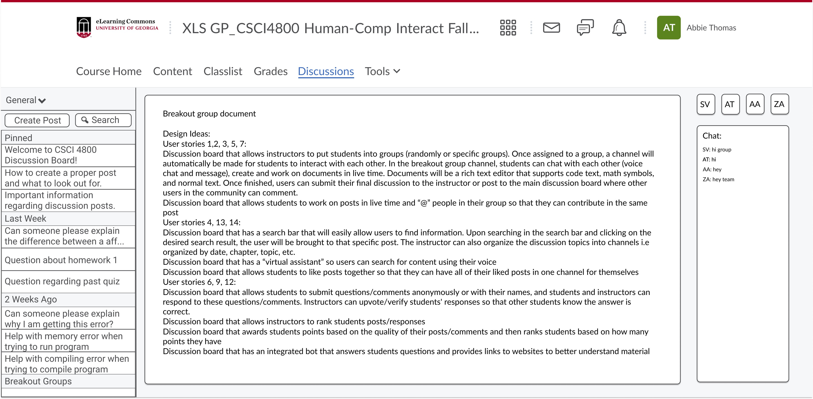

Group chat function:

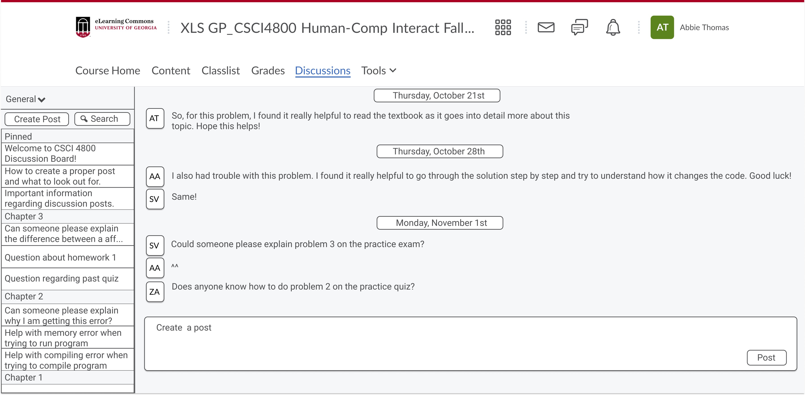

**2. Class Discussion**

Threaded forum layout:

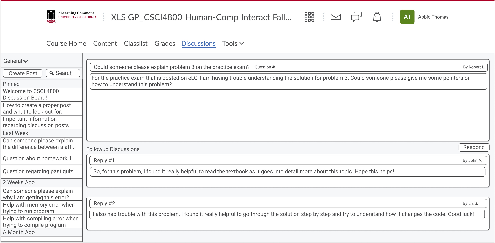

Dump Bucket Layout:

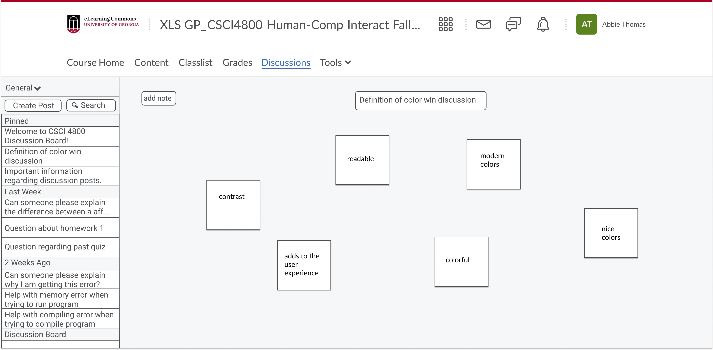

**3. Ask Questions**

Live chat for questions:

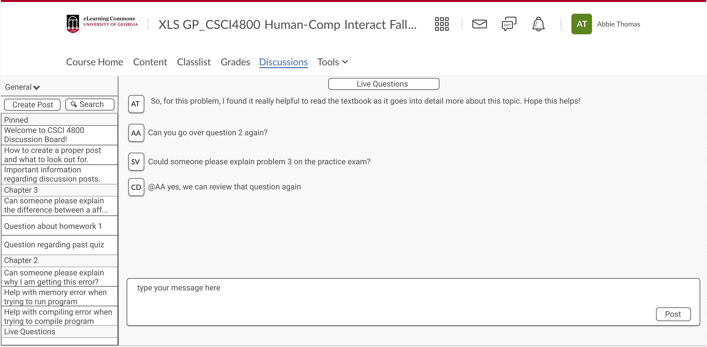

Creating a post in the forum for questions:

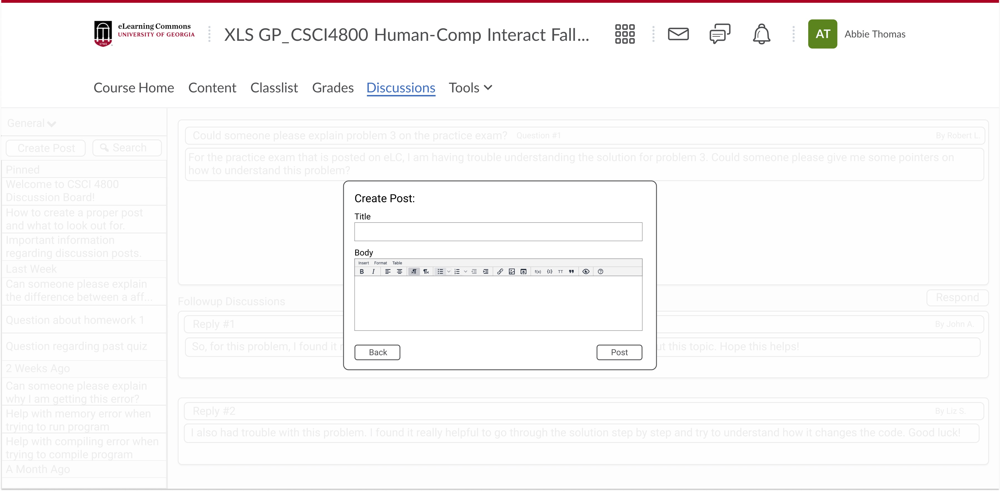

**4. View Previous Discussions**

Search bar location:

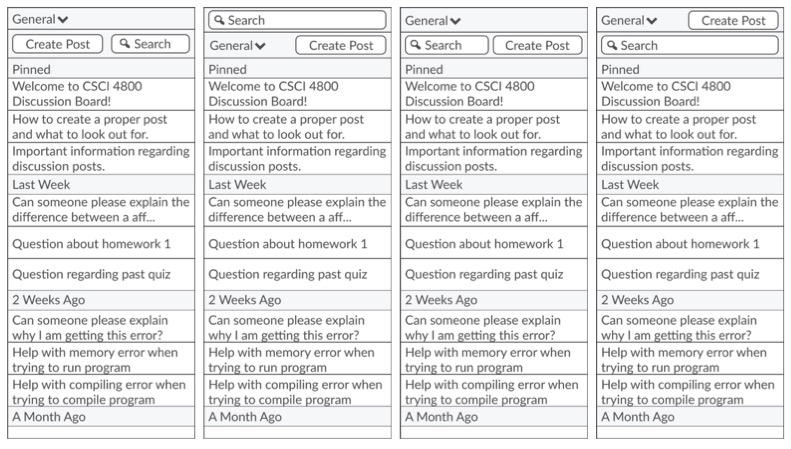

Organize discussion board by topic:

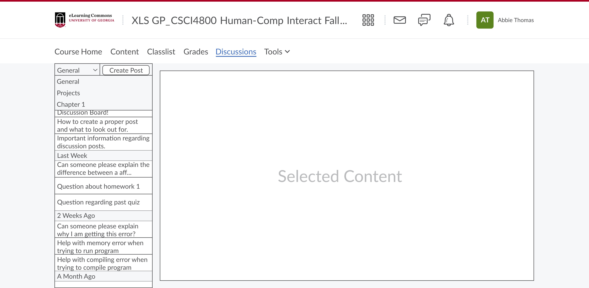

**5. Pin Key Threads**

Pins kept in place or moved to top:

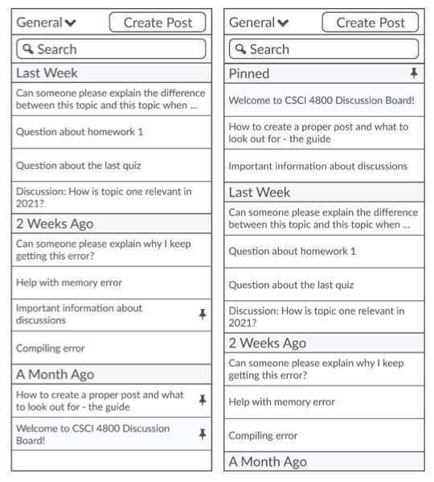

Pinned message:

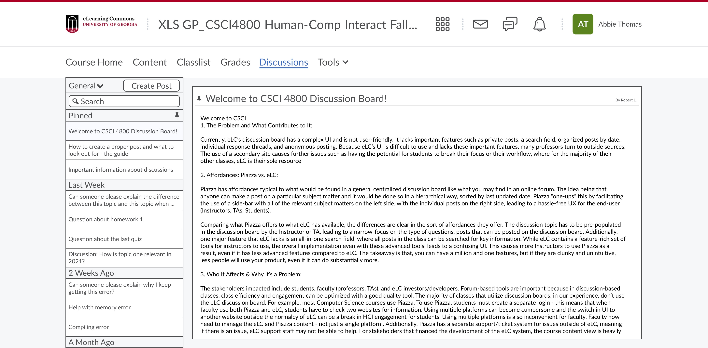

Unpinned message:

Unpinned message (student view):

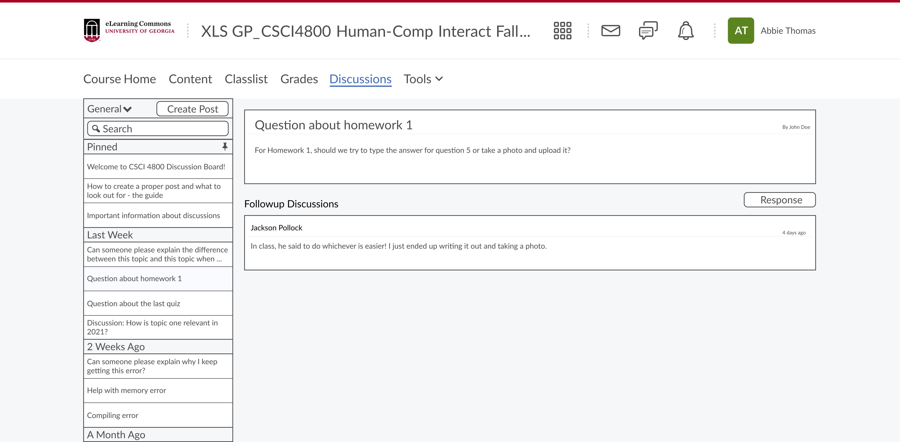

**6. Facilitate Discussion**

**7. Answer Questions**

Pinned Frequently Asked Questions (FAQ) Section:

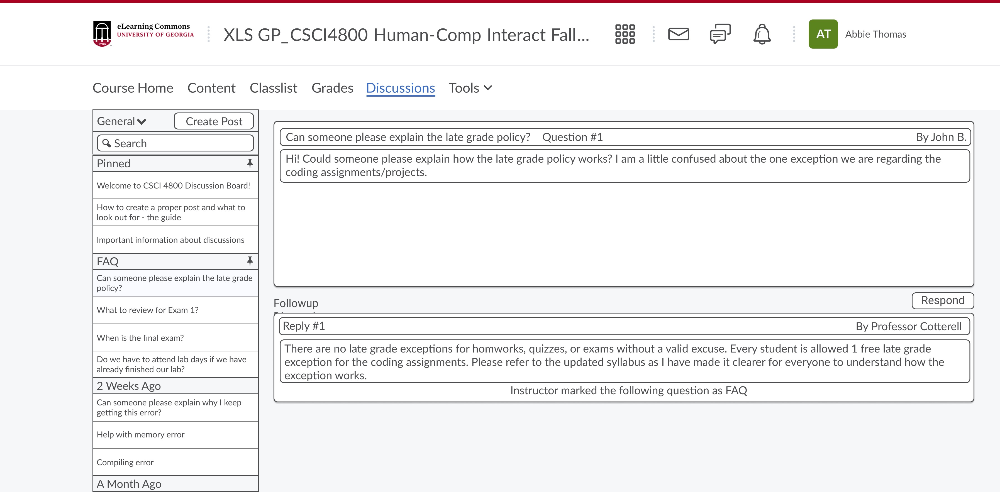

Answer questions through threads:

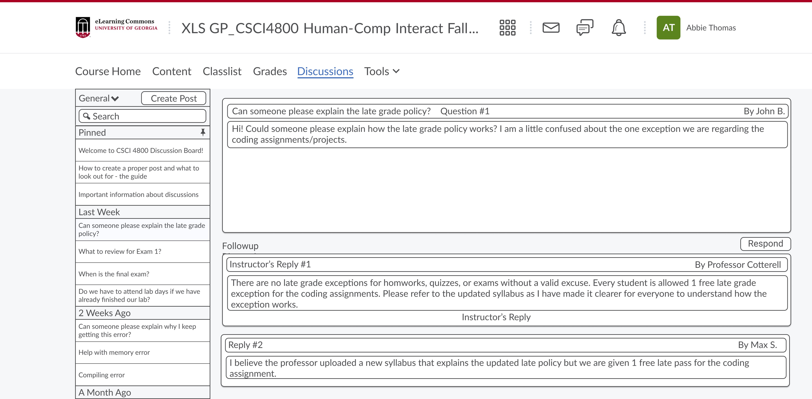

**8. Endorse Responses**

Answers Endorsed by Professor:

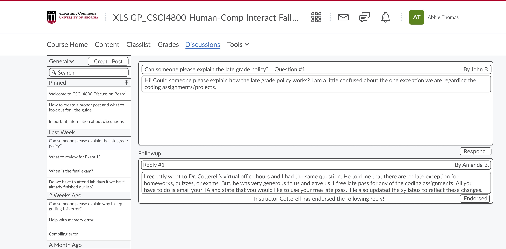

Answers moved to top based on number of likes:

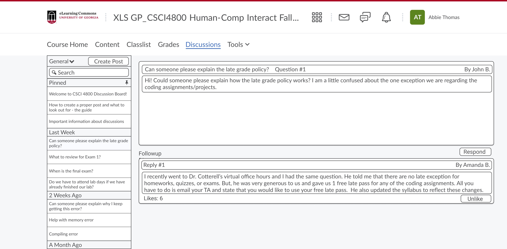

### __Detailed Design__
> *High Fidelity Mockups*

**1. Group Work**

i. CLick "Respond"

ii. Click + to add members (twice for this example)

iii. Click "Respond" to make group or "Cancel" to cancel

iv. Click the message icon to view messages

v. Click the send button to see a sample message

vi. Click "Back" to return to forum page

<iframe style="border: 1px solid rgba(0, 0, 0, 0.1);" width="800" height="450" src="https://www.figma.com/embed?embed_host=share&url=https%3A%2F%2Fwww.figma.com%2Fproto%2FZGIpqWWGOuxBtl7QvjhskM%2FHCI-Guys-Milestone-2%3Fnode-id%3D503%253A3009%26scaling%3Dscale-down-width%26page-id%3D434%253A2%26starting-point-node-id%3D503%253A3009" allowfullscreen></iframe>

**2. Class Discussion**

i. Navigate between posts on the general page

ii. Navigate to other pages (Projects, Chapter 1)

iii. Search Bar

<iframe style="border: 1px solid rgba(0, 0, 0, 0.1);" width="800" height="450" src="https://www.figma.com/embed?embed_host=share&url=https%3A%2F%2Fwww.figma.com%2Fproto%2FZGIpqWWGOuxBtl7QvjhskM%2FHCI-Guys-Milestone-2%3Fnode-id%3D503%253A5507%26scaling%3Dscale-down-width%26page-id%3D434%253A691%26starting-point-node-id%3D503%253A5507%26show-proto-sidebar%3D1" allowfullscreen></iframe>

**3. Ask Questions**

i. Click "Create Post"

ii. Click Title Box to add title

iii. Click Body Box to add body

iv. Click Post to post question

v. Click Back anytime to cancel

<iframe style="border: 1px solid rgba(0, 0, 0, 0.1);" width="800" height="450" src="https://www.figma.com/embed?embed_host=share&url=https%3A%2F%2Fwww.figma.com%2Fproto%2FZGIpqWWGOuxBtl7QvjhskM%2FHCI-Guys-team-library%3Fnode-id%3D467%253A547%26scaling%3Dscale-down-width%26page-id%3D434%253A692%26starting-point-node-id%3D467%253A547" allowfullscreen></iframe>

**4. View Previous Discussions**

i. Click General menu

ii. Use menu to navigate between Projects, Chapter 1, or General pages

iii. Click Search bar to see sample search of "1". 

iv. Click search bar again to exit search

<iframe style="border: 1px solid rgba(0, 0, 0, 0.1);" width="800" height="450" src="https://www.figma.com/embed?embed_host=share&url=https%3A%2F%2Fwww.figma.com%2Fproto%2FZGIpqWWGOuxBtl7QvjhskM%2FHCI-Guys-Milestone-2%3Fnode-id%3D489%253A904%26scaling%3Dscale-down-width%26page-id%3D434%253A693%26starting-point-node-id%3D489%253A658" allowfullscreen></iframe>

**5. Pin Key Threads**

i. Click between pinned note "Welcome to CSCI 4800 Discussion Board" and unpinned note "Questions about Homework 1"

ii. Pin note "Questions about Homework 1" by clicking pin

iii. Unpin note "Questions about Homework 1" by clicking pin again

<iframe style="border: 1px solid rgba(0, 0, 0, 0.1);" width="800" height="450" src="https://www.figma.com/embed?embed_host=share&url=https%3A%2F%2Fwww.figma.com%2Fproto%2FZGIpqWWGOuxBtl7QvjhskM%2FHCI-Guys-Milestone-2%3Fnode-id%3D503%253A1833%26scaling%3Dscale-down-width%26page-id%3D434%253A694%26starting-point-node-id%3D503%253A1833%26show-proto-sidebar%3D1" allowfullscreen></iframe>

**6. Facilitate Discussion**

See Mockup from 2.

**7. Answer Questions**

i. Click "Respond"

ii. Click box "Respond Individually"

iii. Click "Respond" to write response or "Cancel" to Cancel

iv. Click "Back" to go back without posting or "Post" to post response

<iframe style="border: 1px solid rgba(0, 0, 0, 0.1);" width="800" height="450" src="https://www.figma.com/embed?embed_host=share&url=https%3A%2F%2Fwww.figma.com%2Fproto%2FZGIpqWWGOuxBtl7QvjhskM%2FHCI-Guys-Milestone-2%3Fnode-id%3D503%253A3947%26scaling%3Dscale-down-width%26page-id%3D434%253A696%26starting-point-node-id%3D503%253A3583" allowfullscreen></iframe>

**8. Endorse Responses**

i. Click "Endorse" on Jackson Pollock's answer to endorse it

ii. Click "Endorsed!" to unendorse the answer

iii. Hover over "Hover for Student View" to see student view at any time

<iframe style="border: 1px solid rgba(0, 0, 0, 0.1);" width="800" height="450" src="https://www.figma.com/embed?embed_host=share&url=https%3A%2F%2Fwww.figma.com%2Fproto%2FZGIpqWWGOuxBtl7QvjhskM%2FHCI-Guys-Milestone-2%3Fnode-id%3D503%253A4125%26scaling%3Dscale-down-width%26page-id%3D434%253A697%26starting-point-node-id%3D503%253A4125%26show-proto-sidebar%3D1" allowfullscreen></iframe>

__Summary Video__

__Sources__

[Return to Top](#directory)
